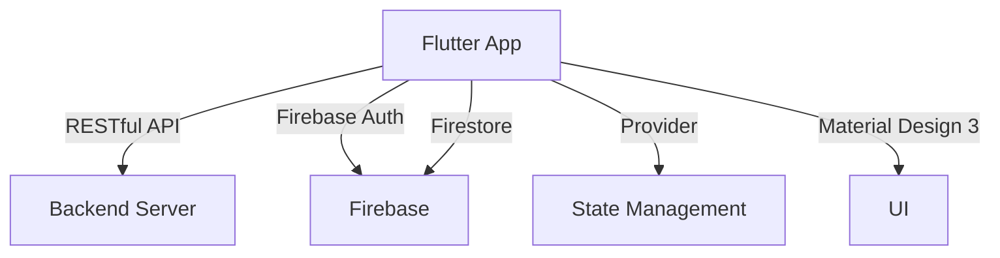

# Home Harmony

[](https://github.com/eng618/HomeHarmony/actions/workflows/ci.yml)
[](https://github.com/eng618/HomeHarmony/actions/workflows/firebase-hosting-merge.yml)

A cross-platform Flutter application for families to manage rules, rewards, and consequences for children.

## Architecture Overview



## Features

- Multi-user support: Parents (admin) and children (restricted)
- Family rules management
- Rewards for chores and good behavior
- Consequence tracking with time-bound restrictions
- RESTful API integration
- Material Design 3 UI
- Firebase Authentication & Firestore

## Getting Started

1. Ensure you have Flutter 3.0+ installed.
2. Run `flutter pub get` to install dependencies.
3. Use `flutter run` to launch the app on your device or emulator.

## Project Structure Overview

```
lib/
  ├── main.dart
  ├── models/
  ├── services/
  ├── views/
  ├── widgets/
  └── utils/
test/ - Automated tests
```

## Customization Instructions

Update the app to fit your family's needs by editing rules, rewards, and consequences in the app UI. For advanced customization, modify models, services, and UI components in the `lib/` directory.

## License

This project is licensed under the MIT License. See [LICENSE](LICENSE) for details.

## Contribution Guidelines

Contributions are welcome! Please open issues or submit pull requests. See [CONTRIBUTING.md](CONTRIBUTING.md) for guidelines.

## Contact Information

Project Maintainers: Eric N. Garcia (<eng618@garciaericn.com>)

## Acknowledgments

- Flutter
- Firebase (firebase_core, firebase_auth, cloud_firestore)
- Provider
- http
- mockito, fake_cloud_firestore (for testing)
- Material Design 3

## Changelog

See [CHANGELOG.md](CHANGELOG.md) for updates and release notes.

## Star History

[](https://www.star-history.com/#eng618/HomeHarmony&Date)

## MVP Implementation Roadmap

The following steps outline the remaining work to reach the MVP (Minimum Viable Product) for Home Harmony. This list will be updated as features are completed.

### Next Steps to MVP

- [x] **Screen Time Integration**
  - [x] Link family members (children) to screen time buckets and timers
  - [x] Parent can view and adjust each child's screen time
  - [x] Child can view their own screen time and session history
  - [x] Real-time updates for active timers and session logging

- [ ] **Rules Management**
  - [ ] CRUD for family rules (parent)
  - [ ] Assign rules to children
  - [ ] Children can view their assigned rules

- [ ] **Rewards & Chores**
  - [ ] CRUD for chores and rewards (parent)
  - [ ] Assign chores to children
  - [ ] Children can mark chores as complete
  - [ ] Parent can approve/reject completions and award screen time
  - [ ] Parent can add screen time to child's bucket as a reward

- [ ] **Consequences**
  - [ ] CRUD for consequences (parent)
  - [ ] Assign consequences to children
  - [ ] Deduct screen time for applied consequences

- [ ] **Activity History**
  - [ ] Log all major actions (rule/chores/consequences/screen time)
  - [ ] Family and child-specific activity feeds

- [x] **Basic Onboarding & Navigation**
  - [x] Smooth navigation between authentication, home, and feature screens
  - [x] Onboarding for new families/parents

- [ ] **Testing & Polish**
  - [ ] Unit/widget tests for all major features
  - [ ] UI/UX polish and accessibility review

---

**We will update this section as features are completed. When all boxes are checked, the app is ready for MVP launch!**
