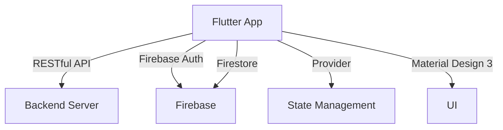

# Home Harmony

[](https://github.com/eng618/HomeHarmony/actions/workflows/ci.yml)
[](https://github.com/eng618/HomeHarmony/actions/workflows/firebase-hosting-merge.yml)

A cross-platform Flutter application for families to manage rules, rewards, and consequences for children.

## Architecture Overview



## Features

- Multi-user support: Parents (admin) and children (restricted)
- Family rules management
- Rewards for chores and good behavior
- Consequence tracking with time-bound restrictions
- RESTful API integration
- Material Design 3 UI
- Firebase Authentication & Firestore

## Getting Started

1. Ensure you have Flutter 3.0+ installed.
2. Run `flutter pub get` to install dependencies.
3. Use `flutter run` to launch the app on your device or emulator.

## Project Structure Overview

```
lib/
  ├── main.dart
  ├── models/
  ├── services/
  ├── views/
  ├── widgets/
  └── utils/
test/ - Automated tests
```

## Customization Instructions

Update the app to fit your family's needs by editing rules, rewards, and consequences in the app UI. For advanced customization, modify models, services, and UI components in the `lib/` directory.

## License

This project is licensed under the MIT License. See [LICENSE](LICENSE) for details.

## Contribution Guidelines

Contributions are welcome! Please open issues or submit pull requests. See [CONTRIBUTING.md](CONTRIBUTING.md) for guidelines.

## Contact Information

Project Maintainers: Eric N. Garcia (<eng618@garciaericn.com>)

## Acknowledgments

- Flutter
- Firebase (firebase_core, firebase_auth, cloud_firestore)
- Provider
- http
- mockito, fake_cloud_firestore (for testing)
- Material Design 3

## Changelog

See [CHANGELOG.md](CHANGELOG.md) for updates and release notes.

---

For more details, see the `.github/copilot-instructions.md` file.
