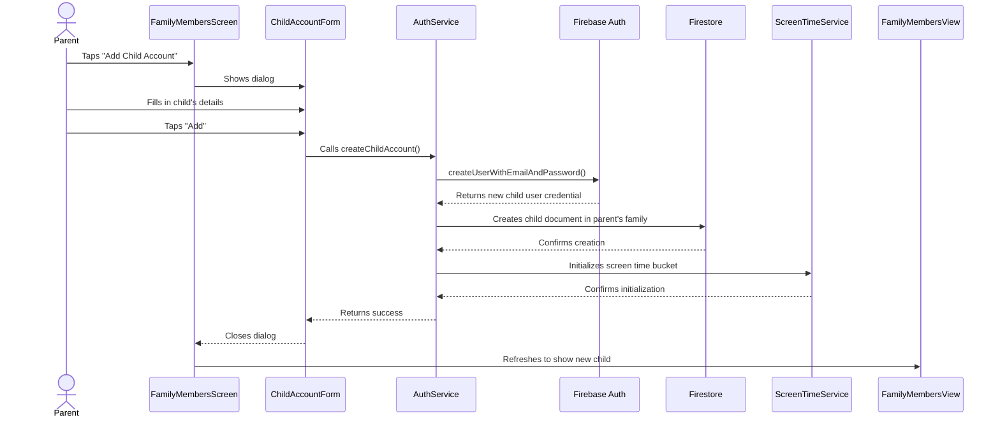
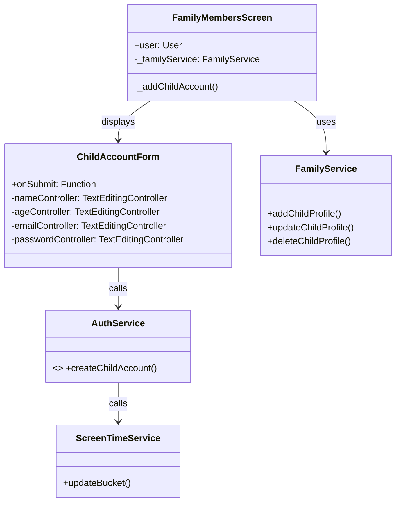
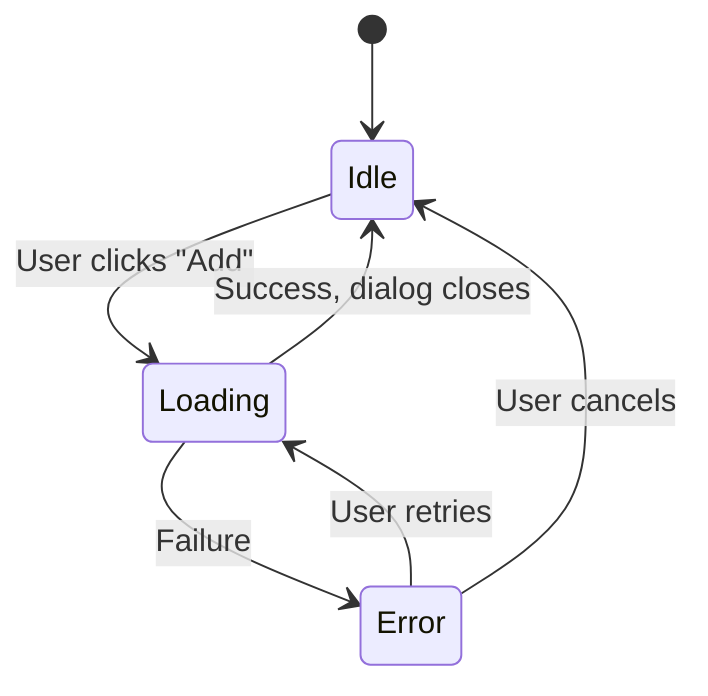

# Child Account Creation Flow

This document outlines the process of creating a new child account within the HomeHarmony application.

## High-Level Overview

The child account creation process involves a parent user initiating the creation, filling out the child's details, and the system then creating a new user in Firebase Authentication and a corresponding child profile in Firestore.

## Sequence Diagram

The following sequence diagram illustrates the interactions between the user and the different components of the system during child account creation.

## Class Diagram

This diagram shows the main classes involved in the child account creation flow and their relationships.

## State Diagram

This diagram illustrates the states of the `ChildAccountForm` during the creation process.

